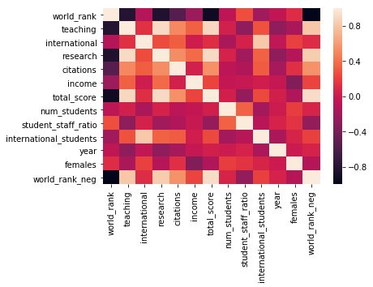
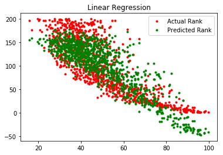

# Analyzing Times Higher Education (THE) World University Rankings

Github link: https://github.com/Jleebs90/university_rankings/blob/master/Capstone.ipynb 

### Questions to Answer
* What factors are the best indicators of a university's ranking? 
* What other relationships exist between variables? 
* Can we predict rankings based on other variables? 

### Data Extraction
* Data Source:
    * Times Higher Education (THE) World University Rankings from 2011 - 2016
    * Uploaded from https://www.kaggle.com/tigranhovsepyan99/university-rankings/data 
 

* About the Data:
    * Dataset includes university rankings and THE scores, as well as non-scored variables such as university name, country, year, number of students, student:staff ratio, etc. 
    * Universities are ranked annually by their total score
    * The total score (0-100) is based on these scores:  
            * Teaching -  overall learning environment
            * Research - volume & reputation of research
            * Citations - influence of research
            * Income - industry knowledge transfer
            * International Outlook - staff, students & research  


```python
import numpy as np
import pandas as pd
import matplotlib.pyplot as plt
import statsmodels
import statsmodels.stats as stats
import seaborn as sns

# read data from dropbox file
df = pd.read_csv('https://www.dropbox.com/s/h1c5n4r41hlxzyy/timesData.csv?dl=1')

# view head, column names, summary of numeric columns
print(list(df)) 
df.head()


```

    ['world_rank', 'university_name', 'country', 'teaching', 'international', 'research', 'citations', 'income', 'total_score', 'num_students', 'student_staff_ratio', 'international_students', 'female_male_ratio', 'year']


<div>
<style>
    .dataframe thead tr:only-child th {
        text-align: right;
    }

    .dataframe thead th {
        text-align: left;
    }

    .dataframe tbody tr th {
        vertical-align: top;
    }
</style>
<table border="1" class="dataframe">
  <thead>
    <tr style="text-align: right;">
      <th></th>
      <th>world_rank</th>
      <th>university_name</th>
      <th>country</th>
      <th>teaching</th>
      <th>international</th>
      <th>research</th>
      <th>citations</th>
      <th>income</th>
      <th>total_score</th>
      <th>num_students</th>
      <th>student_staff_ratio</th>
      <th>international_students</th>
      <th>female_male_ratio</th>
      <th>year</th>
    </tr>
  </thead>
  <tbody>
    <tr>
      <th>0</th>
      <td>1</td>
      <td>Harvard University</td>
      <td>United States of America</td>
      <td>99.7</td>
      <td>72.4</td>
      <td>98.7</td>
      <td>98.8</td>
      <td>34.5</td>
      <td>96.1</td>
      <td>20,152</td>
      <td>8.9</td>
      <td>25%</td>
      <td>NaN</td>
      <td>2011</td>
    </tr>
    <tr>
      <th>1</th>
      <td>2</td>
      <td>California Institute of Technology</td>
      <td>United States of America</td>
      <td>97.7</td>
      <td>54.6</td>
      <td>98.0</td>
      <td>99.9</td>
      <td>83.7</td>
      <td>96.0</td>
      <td>2,243</td>
      <td>6.9</td>
      <td>27%</td>
      <td>33 : 67</td>
      <td>2011</td>
    </tr>
    <tr>
      <th>2</th>
      <td>3</td>
      <td>Massachusetts Institute of Technology</td>
      <td>United States of America</td>
      <td>97.8</td>
      <td>82.3</td>
      <td>91.4</td>
      <td>99.9</td>
      <td>87.5</td>
      <td>95.6</td>
      <td>11,074</td>
      <td>9.0</td>
      <td>33%</td>
      <td>37 : 63</td>
      <td>2011</td>
    </tr>
    <tr>
      <th>3</th>
      <td>4</td>
      <td>Stanford University</td>
      <td>United States of America</td>
      <td>98.3</td>
      <td>29.5</td>
      <td>98.1</td>
      <td>99.2</td>
      <td>64.3</td>
      <td>94.3</td>
      <td>15,596</td>
      <td>7.8</td>
      <td>22%</td>
      <td>42 : 58</td>
      <td>2011</td>
    </tr>
    <tr>
      <th>4</th>
      <td>5</td>
      <td>Princeton University</td>
      <td>United States of America</td>
      <td>90.9</td>
      <td>70.3</td>
      <td>95.4</td>
      <td>99.9</td>
      <td>-</td>
      <td>94.2</td>
      <td>7,929</td>
      <td>8.4</td>
      <td>27%</td>
      <td>45 : 55</td>
      <td>2011</td>
    </tr>
  </tbody>
</table>
</div>


### Data Cleaning
* Convert numeric columns from string to float
    * Convert ratios and percentages to decimals
    * Remove commas in numeric values
    * Apply float type when needed
    
    
* Create new column where ranking is a negative value
    * Since low rankings are good and high rankings are bad, visualizations can be confusing
    * We can use the negative ranking to make intuitive scatterplots 


```python
# clean up columns with commas and percentages 
df['num_students'] = df['num_students'].str.replace(",","").astype(float)
df['international_students'] = df['international_students'].str.replace("%","").astype(float) / 100 

# convert columns to numeric type 
cols = ['world_rank', 'international', 'income', 'total_score', 'num_students', 'international_students']
df[cols] = df[cols].apply(pd.to_numeric, errors='coerce')

# Convert female:male ratio into numeric by partitioning the ratio then extracting the % females
df['female_male_ratio'] = df['female_male_ratio'].astype(str)
female = df['female_male_ratio'].str.partition(pat=':', expand=True)[0].apply(pd.to_numeric, errors='coerce')  
df['females'] = female/100

# create negative value for world ranking
df['world_rank_neg'] = 0 - df['world_rank']

df.describe() 
```


<div>
<style>
    .dataframe thead tr:only-child th {
        text-align: right;
    }

    .dataframe thead th {
        text-align: left;
    }

    .dataframe tbody tr th {
        vertical-align: top;
    }
</style>
<table border="1" class="dataframe">
  <thead>
    <tr style="text-align: right;">
      <th></th>
      <th>world_rank</th>
      <th>teaching</th>
      <th>international</th>
      <th>research</th>
      <th>citations</th>
      <th>income</th>
      <th>total_score</th>
      <th>num_students</th>
      <th>student_staff_ratio</th>
      <th>international_students</th>
      <th>year</th>
      <th>females</th>
      <th>world_rank_neg</th>
    </tr>
  </thead>
  <tbody>
    <tr>
      <th>count</th>
      <td>1112.000000</td>
      <td>2603.000000</td>
      <td>2594.000000</td>
      <td>2603.000000</td>
      <td>2603.000000</td>
      <td>2385.000000</td>
      <td>1201.000000</td>
      <td>2544.000000</td>
      <td>2544.000000</td>
      <td>2536.000000</td>
      <td>2603.000000</td>
      <td>2367.000000</td>
      <td>1112.000000</td>
    </tr>
    <tr>
      <th>mean</th>
      <td>98.201439</td>
      <td>37.801498</td>
      <td>52.007440</td>
      <td>35.910257</td>
      <td>60.921629</td>
      <td>48.979874</td>
      <td>59.846128</td>
      <td>23873.758648</td>
      <td>18.445283</td>
      <td>0.154440</td>
      <td>2014.075682</td>
      <td>0.496840</td>
      <td>-98.201439</td>
    </tr>
    <tr>
      <th>std</th>
      <td>58.097290</td>
      <td>17.604218</td>
      <td>22.103825</td>
      <td>21.254805</td>
      <td>23.073219</td>
      <td>21.179938</td>
      <td>12.803446</td>
      <td>17675.946877</td>
      <td>11.458698</td>
      <td>0.105915</td>
      <td>1.685733</td>
      <td>0.108596</td>
      <td>58.097290</td>
    </tr>
    <tr>
      <th>min</th>
      <td>1.000000</td>
      <td>9.900000</td>
      <td>7.100000</td>
      <td>2.900000</td>
      <td>1.200000</td>
      <td>24.200000</td>
      <td>41.400000</td>
      <td>462.000000</td>
      <td>0.600000</td>
      <td>0.000000</td>
      <td>2011.000000</td>
      <td>0.010000</td>
      <td>-200.000000</td>
    </tr>
    <tr>
      <th>25%</th>
      <td>48.000000</td>
      <td>24.700000</td>
      <td>33.425000</td>
      <td>19.600000</td>
      <td>45.500000</td>
      <td>33.000000</td>
      <td>50.300000</td>
      <td>12637.750000</td>
      <td>11.975000</td>
      <td>0.080000</td>
      <td>2013.000000</td>
      <td>0.460000</td>
      <td>-148.000000</td>
    </tr>
    <tr>
      <th>50%</th>
      <td>97.000000</td>
      <td>33.900000</td>
      <td>50.300000</td>
      <td>30.500000</td>
      <td>62.500000</td>
      <td>41.000000</td>
      <td>56.000000</td>
      <td>20851.000000</td>
      <td>16.100000</td>
      <td>0.130000</td>
      <td>2014.000000</td>
      <td>0.520000</td>
      <td>-97.000000</td>
    </tr>
    <tr>
      <th>75%</th>
      <td>148.000000</td>
      <td>46.400000</td>
      <td>69.000000</td>
      <td>47.250000</td>
      <td>79.050000</td>
      <td>59.000000</td>
      <td>66.200000</td>
      <td>29991.000000</td>
      <td>21.500000</td>
      <td>0.210000</td>
      <td>2016.000000</td>
      <td>0.560000</td>
      <td>-48.000000</td>
    </tr>
    <tr>
      <th>max</th>
      <td>200.000000</td>
      <td>99.700000</td>
      <td>100.000000</td>
      <td>99.400000</td>
      <td>100.000000</td>
      <td>100.000000</td>
      <td>96.100000</td>
      <td>379231.000000</td>
      <td>162.600000</td>
      <td>0.820000</td>
      <td>2016.000000</td>
      <td>1.000000</td>
      <td>-1.000000</td>
    </tr>
  </tbody>
</table>
</div>


### Data Visualization

#### Histograms: Visualizing distribution of score values 
* Citation scores are left-skewed (leaning to the right), while most score distributions are right-skewed.
    * Citations are counted objectively and therefore less critical? 
    
#### Scatter Plots: Visualizing relationships between scores and world rank
* All scores have a positive linear correlation with world rank


```python
%matplotlib inline
fig, ax = plt.subplots(figsize=(15,10)) 
fig.suptitle('Distribution of Scores', fontsize=16)

plt.subplot(2,3,1)
plt.xlabel('Total Score')
plt.hist(df['total_score'][~np.isnan(df['total_score'])], bins="auto")

plt.subplot(2,3,2)
plt.xlabel('Research Score')  
plt.hist(df['research'][~np.isnan(df['research'])], bins="auto")

plt.subplot(2,3,3)
plt.xlabel('Teaching Score')  
plt.hist(df['teaching'][~np.isnan(df['teaching'])],  bins="auto")


plt.subplot(2,3,4)
plt.xlabel('Income Score')
plt.hist(df['income'][~np.isnan(df['income'])], bins="auto")

plt.subplot(2,3,5)
plt.xlabel('International Score')  
plt.hist(df['international'][~np.isnan(df['international'])], bins="auto")

plt.subplot(2,3,6)
plt.xlabel('Citation Score')  
plt.hist(df['citations'][~np.isnan(df['citations'])],  bins="auto")
plt.show()

```


```python
# using the negative ranking variable to make graphs more intuitive 
# isolate 2016 data to make the plots cleaner (no redundancy)

df16 = df.loc[df['year']==2016,:]
%matplotlib inline

fig, ax = plt.subplots(figsize=(15,10)) 
fig.suptitle('Scores vs World Rank', fontsize=16)

plt.subplot(2,3,1)
sns.regplot(x='total_score', y="world_rank_neg", data=df16) 
plt.xlabel('Total Score')  

plt.subplot(2,3,2)
sns.regplot(x='research', y="world_rank_neg", data=df16) 
plt.xlabel('Research Score')  

plt.subplot(2,3,3)
sns.regplot(x='teaching', y="world_rank_neg", data=df16) 
plt.xlabel('Teaching Score')  

plt.subplot(2,3,4)
sns.regplot(x="income", y="world_rank_neg", data=df16) 
plt.xlabel('Income Score')   


plt.subplot(2,3,5)
sns.regplot(x="international", y="world_rank_neg", data=df16) 
plt.xlabel('International Score')   

plt.subplot(2,3,6)
sns.regplot(x="citations", y="world_rank_neg", data=df16) 
plt.xlabel('Citation Score')   

plt.show()
```


### Descriptive Analysis

* World rank is highly correlated with teaching and research scores (over .80) 
* Teaching and research scores are also highly correlated with each other (.91)
    * Are these metrics redundant or biased? 
* World rank is negatively correlated with student: staff ratio (-.26)
    * Makes sense - larger classrooms compromise quality
* The % of females is NEGATIVELY correlated with income score (-.35) 
   * Why do higher proportions of females bring income scores down? Harder for females to monetize and distribute their research? 

 


```python
# correlation matrix
# note that low ranking is good, which is why world rank has negative correlations with other scores 
corr = df.corr()
sns.heatmap(corr, 
            xticklabels=corr.columns.values,
            yticklabels=corr.columns.values)
plt.show()
corr
```





<div>
<style>
    .dataframe thead tr:only-child th {
        text-align: right;
    }

    .dataframe thead th {
        text-align: left;
    }

    .dataframe tbody tr th {
        vertical-align: top;
    }
</style>
<table border="1" class="dataframe">
  <thead>
    <tr style="text-align: right;">
      <th></th>
      <th>world_rank</th>
      <th>teaching</th>
      <th>international</th>
      <th>research</th>
      <th>citations</th>
      <th>income</th>
      <th>total_score</th>
      <th>num_students</th>
      <th>student_staff_ratio</th>
      <th>international_students</th>
      <th>year</th>
      <th>females</th>
      <th>world_rank_neg</th>
    </tr>
  </thead>
  <tbody>
    <tr>
      <th>world_rank</th>
      <td>1.000000</td>
      <td>-0.809650</td>
      <td>-0.113274</td>
      <td>-0.832917</td>
      <td>-0.549495</td>
      <td>-0.225471</td>
      <td>-0.919340</td>
      <td>-0.063744</td>
      <td>0.258907</td>
      <td>-0.201389</td>
      <td>-0.058574</td>
      <td>0.114738</td>
      <td>-1.000000</td>
    </tr>
    <tr>
      <th>teaching</th>
      <td>-0.809650</td>
      <td>1.000000</td>
      <td>0.137834</td>
      <td>0.913120</td>
      <td>0.503867</td>
      <td>0.328457</td>
      <td>0.894085</td>
      <td>0.042844</td>
      <td>-0.282630</td>
      <td>0.278663</td>
      <td>-0.278108</td>
      <td>-0.156654</td>
      <td>0.809650</td>
    </tr>
    <tr>
      <th>international</th>
      <td>-0.113274</td>
      <td>0.137834</td>
      <td>1.000000</td>
      <td>0.251146</td>
      <td>0.325030</td>
      <td>0.011053</td>
      <td>0.123829</td>
      <td>-0.154742</td>
      <td>0.053899</td>
      <td>0.814798</td>
      <td>-0.050160</td>
      <td>0.206190</td>
      <td>0.113274</td>
    </tr>
    <tr>
      <th>research</th>
      <td>-0.832917</td>
      <td>0.913120</td>
      <td>0.251146</td>
      <td>1.000000</td>
      <td>0.525264</td>
      <td>0.381564</td>
      <td>0.904166</td>
      <td>0.059921</td>
      <td>-0.198841</td>
      <td>0.336260</td>
      <td>-0.274451</td>
      <td>-0.113632</td>
      <td>0.832917</td>
    </tr>
    <tr>
      <th>citations</th>
      <td>-0.549495</td>
      <td>0.503867</td>
      <td>0.325030</td>
      <td>0.525264</td>
      <td>1.000000</td>
      <td>0.045876</td>
      <td>0.546015</td>
      <td>-0.076886</td>
      <td>-0.137737</td>
      <td>0.314295</td>
      <td>-0.173544</td>
      <td>0.126031</td>
      <td>0.549495</td>
    </tr>
    <tr>
      <th>income</th>
      <td>-0.225471</td>
      <td>0.328457</td>
      <td>0.011053</td>
      <td>0.381564</td>
      <td>0.045876</td>
      <td>1.000000</td>
      <td>0.226557</td>
      <td>-0.044412</td>
      <td>-0.020805</td>
      <td>0.030033</td>
      <td>-0.029956</td>
      <td>-0.349623</td>
      <td>0.225471</td>
    </tr>
    <tr>
      <th>total_score</th>
      <td>-0.919340</td>
      <td>0.894085</td>
      <td>0.123829</td>
      <td>0.904166</td>
      <td>0.546015</td>
      <td>0.226557</td>
      <td>1.000000</td>
      <td>0.033979</td>
      <td>-0.255692</td>
      <td>0.234818</td>
      <td>0.037239</td>
      <td>-0.140555</td>
      <td>0.919340</td>
    </tr>
    <tr>
      <th>num_students</th>
      <td>-0.063744</td>
      <td>0.042844</td>
      <td>-0.154742</td>
      <td>0.059921</td>
      <td>-0.076886</td>
      <td>-0.044412</td>
      <td>0.033979</td>
      <td>1.000000</td>
      <td>0.342824</td>
      <td>-0.181870</td>
      <td>0.003432</td>
      <td>0.191069</td>
      <td>0.063744</td>
    </tr>
    <tr>
      <th>student_staff_ratio</th>
      <td>0.258907</td>
      <td>-0.282630</td>
      <td>0.053899</td>
      <td>-0.198841</td>
      <td>-0.137737</td>
      <td>-0.020805</td>
      <td>-0.255692</td>
      <td>0.342824</td>
      <td>1.000000</td>
      <td>-0.086417</td>
      <td>0.060728</td>
      <td>0.148303</td>
      <td>-0.258907</td>
    </tr>
    <tr>
      <th>international_students</th>
      <td>-0.201389</td>
      <td>0.278663</td>
      <td>0.814798</td>
      <td>0.336260</td>
      <td>0.314295</td>
      <td>0.030033</td>
      <td>0.234818</td>
      <td>-0.181870</td>
      <td>-0.086417</td>
      <td>1.000000</td>
      <td>-0.158954</td>
      <td>0.067836</td>
      <td>0.201389</td>
    </tr>
    <tr>
      <th>year</th>
      <td>-0.058574</td>
      <td>-0.278108</td>
      <td>-0.050160</td>
      <td>-0.274451</td>
      <td>-0.173544</td>
      <td>-0.029956</td>
      <td>0.037239</td>
      <td>0.003432</td>
      <td>0.060728</td>
      <td>-0.158954</td>
      <td>1.000000</td>
      <td>-0.003346</td>
      <td>0.058574</td>
    </tr>
    <tr>
      <th>females</th>
      <td>0.114738</td>
      <td>-0.156654</td>
      <td>0.206190</td>
      <td>-0.113632</td>
      <td>0.126031</td>
      <td>-0.349623</td>
      <td>-0.140555</td>
      <td>0.191069</td>
      <td>0.148303</td>
      <td>0.067836</td>
      <td>-0.003346</td>
      <td>1.000000</td>
      <td>-0.114738</td>
    </tr>
    <tr>
      <th>world_rank_neg</th>
      <td>-1.000000</td>
      <td>0.809650</td>
      <td>0.113274</td>
      <td>0.832917</td>
      <td>0.549495</td>
      <td>0.225471</td>
      <td>0.919340</td>
      <td>0.063744</td>
      <td>-0.258907</td>
      <td>0.201389</td>
      <td>0.058574</td>
      <td>-0.114738</td>
      <td>1.000000</td>
    </tr>
  </tbody>
</table>
</div>


### Predicting University Rank from Scores

* How can we predict a university's ranking from its individual scores (not including total score)  
* Compare sklearn linear regression with random forest regression model 
    * Random forest is better fitting
    


```python
import sklearn
from patsy import dmatrices
from sklearn import ensemble
from sklearn import model_selection

%matplotlib inline

# Sklearn Linear regression 
from sklearn import linear_model
model = linear_model.LinearRegression(fit_intercept=False)
y,X = dmatrices('world_rank ~ teaching + research + international + income + citations', data=df)
model.fit(X, y)
yhat = model.predict(X)
plt.title("Linear Regression")
plt.plot(X[:,1], y, 'r.')
plt.plot(X[:,1], model.predict(X), 'g.')
plt.legend(['Actual Rank', 'Predicted Rank'])
plt.show() 

# view distribution of predictions vs actual 
sns.distplot(y - yhat)
plt.title("Linear Dist Plot")
plt.show()

# Random forest regression 
model = sklearn.ensemble.RandomForestRegressor()
y,X = dmatrices('world_rank ~ teaching + research + international + income + citations', data=df)
model.fit(X, y)
yhat = model.predict(X)
plt.title("Random Forest")
plt.plot(X[:,1], y, 'r.')
plt.plot(X[:,1], model.predict(X), 'g.')
plt.legend(['Actual Rank', 'Predicted Rank'])
plt.show() 


# view distribution of predictions vs actual 
sns.distplot(y.ravel() - yhat)
plt.title("Random Forest Dist Plot")
plt.show()


```





    /anaconda3/lib/python3.6/site-packages/ipykernel_launcher.py:28: DataConversionWarning: A column-vector y was passed when a 1d array was expected. Please change the shape of y to (n_samples,), for example using ravel().


